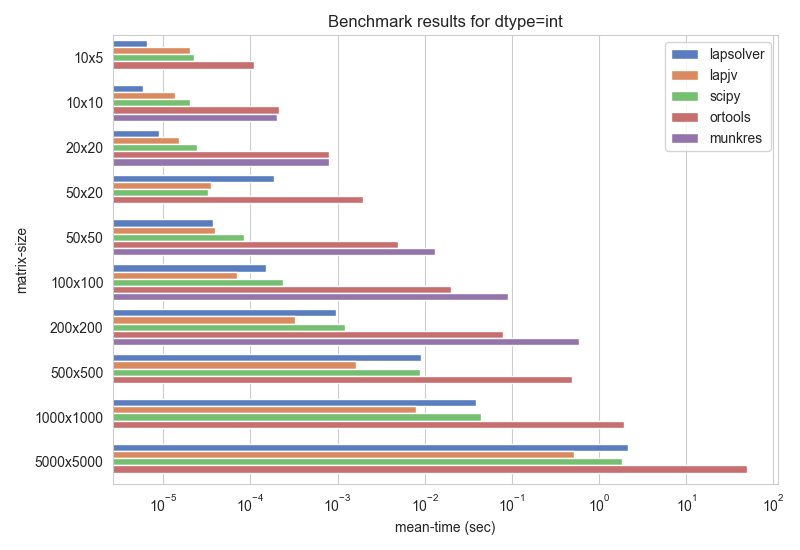
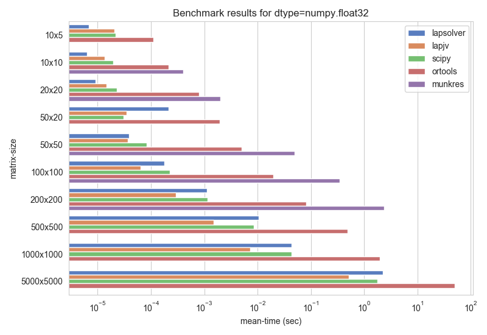

## py-lapsolver

**py-lapsolver** implements a Linear sum Assignment Problem (LAP) solver for dense matrices based on shortest path augmentation in Python. In practice, it solves 5000x5000 problems in around 3 seconds.

### Install

```
pip install [--pre] lapsolver 
```

Windows binary wheels are provided for Python 3.5/3.6. Source wheels otherwise.

### Install from source

Clone this repository 

```
git clone --recursive https://github.com/cheind/py-lapsolver.git
``` 

Then build the project and exectute tests

```
python setup.py develop
python setup.py test
```

Executing the tests requires `pytest` and optionally `pytest-benchmark` for generating benchmarks.

### Usage

```python
import numpy as np
from lapsolver import solve_dense

costs = np.array([
    [6, 9, 1],
    [10, 3, 2],
    [8, 7, 4.]
], dtype=np.float32)    

rids, cids = solve_dense(costs)

for r,c in zip(rids, cids):
    print(r,c) # Row/column pairings
"""
0 2
1 1
2 0
"""
```

You may also want to mark certain pairings impossible

```python
# Matrix with non-allowed pairings
costs = np.array([
    [5, 9, np.nan],
    [10, np.nan, 2],
    [8, 7, 4.]]
)

rids, cids = solve_dense(costs)

for r,c in zip(rids, cids):
    print(r,c) # Row/column pairings
"""
0 0
1 2
2 1
"""
```

### Benchmarks

Comparisons below are generated by scripts in [`./lapsolver/benchmarks`](./lapsolver/benchmarks). 

Currently, the following solvers are tested
 - `lapjv` - https://github.com/gatagat/lap
 - `munkres` - http://software.clapper.org/munkres/
 - `ortools` - https://github.com/google/or-tools **
 - `scipy` - https://github.com/scipy/scipy/tree/master/scipy
 - `lapsolver` - this project

**reduced performance due to costly dense matrix to graph conversion. If you know a better way, please let me know.

Please note that the x-axis is scaled logarithmically. Missing bars indicate excessive runtime or errors in returned result.



#### Additional Benchmarks

Berhane performs an in depth analysis of Python3 linear assignment problem solver at https://github.com/berhane/LAP-solvers

### References
**py-lapsolver** heavily relies on [code](https://github.com/jaehyunp/stanfordacm/blob/9e1375cd4eba68a59dd7b1e2f81692653e9908a9/code/MinCostMatching.cc) published by  @jaehyunp at https://github.com/jaehyunp/
